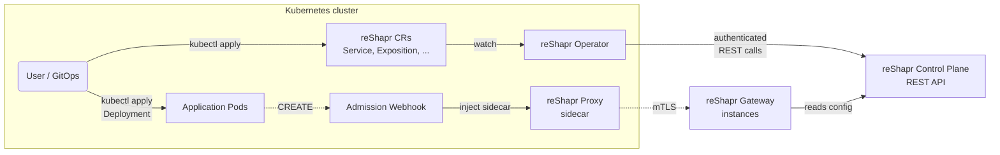
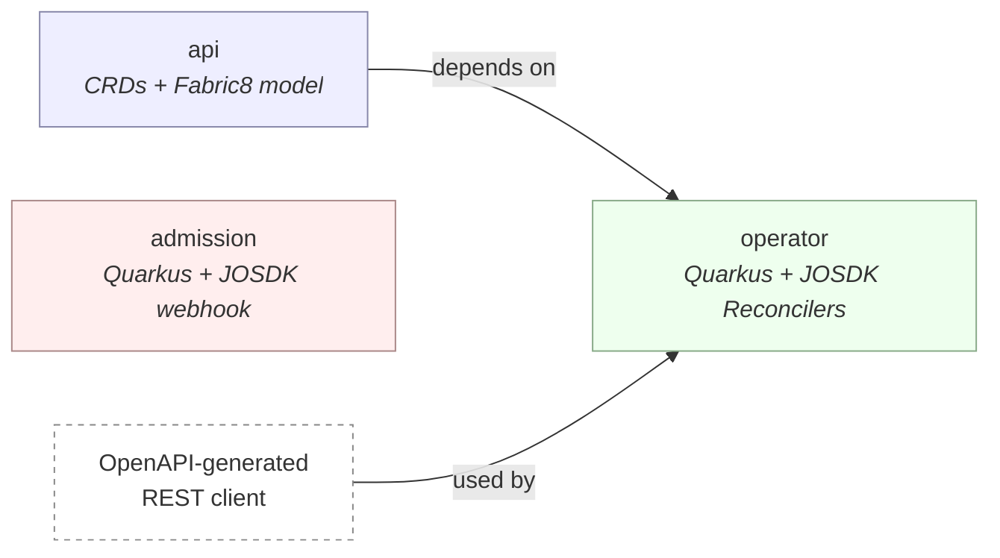

# Architecture

This document is the **canonical technical overview** of the `reshapr-controllers` repository.
It targets contributors and integrators who want to understand how the pieces fit together and
why. For user-oriented guides (installation, CR references), see
[`documentation/`](./documentation/README.md). For agent-facing conventions, see
[`AGENTS.md`](./AGENTS.md) — which explicitly delegates architectural context to this file.

## What this repository is (and is not)

`reshapr-controllers` is a set of Kubernetes-side controllers that let you **drive an existing
reShapr control plane declaratively** via Kubernetes Custom Resources. It is *not* a
distribution of the reShapr control plane itself — the control plane must already be running in
the cluster (typically deployed via
[reshaprio/reshapr-helm-charts](https://github.com/reshaprio/reshapr-helm-charts)) before these
controllers can do anything useful.

Concretely, this repo ships three complementary building blocks:

* **CRDs + Java API library** modelling reShapr concepts (`Service`, `GatewayGroup`,
  `ConfigurationPlan`, `Exposition`, `SecretSource`, `CustomTools`) as first-class Kubernetes
  objects.
* **A Kubernetes Operator** that watches these CRs and reconciles them against the reShapr
  control plane through its public REST API.
* **A Mutating Admission Webhook** that transparently injects a reShapr proxy sidecar into
  application Pods opting in via annotation, and provisions the accompanying discovery/MCP
  Services.

## How it works — high-level data flow

At runtime:

1. A user (or a GitOps tool) applies a reShapr CR (`Service`, `Exposition`, ...) in a
   Kubernetes namespace.
2. The operator watches the CR, authenticates against the target control plane using a
   projected Kubernetes ServiceAccount token, and calls the reShapr REST API to create/update
   the corresponding resource in the control plane.
3. In parallel, application Deployments carrying the `io.reshapr/inject: "true"` annotation
   trigger the admission webhook on Pod `CREATE`. The webhook mutates the Pod spec to inject
   the reShapr proxy sidecar and a small companion reconciler provisions the associated
   `Service` objects.
4. The proxy sidecar dials the reShapr gateways, which read their configuration from the
   control plane and enforce the plans/expositions the operator has just reconciled.

## Module map

The repository is a multi-module Maven build (`io.reshapr:reshapr-controllers`) with three
modules and a strict dependency flow:

| Module        | Purpose                                                             | Depends on          | Published as                                           |
|---------------|---------------------------------------------------------------------|---------------------|--------------------------------------------------------|
| `api/`        | Kubernetes CRD definitions (Fabric8 `CustomResource<Spec, Status>`) and shared model classes for API group `reshapr.io/v1alpha1`. | —                   | `io.reshapr:reshapr-kube-api` (JAR)                    |
| `operator/`   | Quarkus-based Kubernetes operator using Java Operator SDK (JOSDK). Contains all `Reconciler<T>` implementations and the OpenAPI-generated REST client to the control plane. | `api/`, generated OpenAPI client | Container image `quay.io/reshapr/reshapr-operator`     |
| `admission/`  | Quarkus-based mutating admission webhook. Uses the JOSDK webhooks framework for the `/mutate` endpoint and hosts one internal reconciler for accompanying Kubernetes `Service` provisioning. | *(none)*            | Container image `quay.io/reshapr/reshapr-admission-controller` |

> [!NOTE]
> `admission/` intentionally does **not** depend on `api/`. It mutates core `Pod` objects and
> reconciles core `Deployment` / `Service` objects — it never touches reShapr CRs. Keeping the
> dependency out avoids bloating the webhook image with CRD models it does not use and clarifies
> its blast radius during security reviews.

## Notable design decisions

### 1. Three modules, two container images

Splitting `api/`, `operator/` and `admission/` costs one extra Maven module but buys real
independence:

* Users can consume the CRD Java library (`reshapr-kube-api`) from **any** Java project without
  pulling in Quarkus, JOSDK or the OpenAPI runtime.
* The admission webhook and the operator have very different failure and security profiles
  (the webhook is on the API-server hot path, the operator is not). Keeping them in separate
  processes, images and Deployments prevents one from taking the other down.

### 2. OpenAPI-generated REST client for the control plane

The operator does not call the control plane through a hand-written client. Instead, it
generates one at build time from
[`operator/api/reshapr-public-openapi-v0.1.yaml`](./operator/api/reshapr-public-openapi-v0.1.yaml)
via `openapi-generator-maven-plugin`, into `io.reshapr.client.{api,model}`.

Trade-offs:

* **Pro** — the client always matches the control plane's contract, and breaking changes are
  caught at build time by compilation errors in reconcilers.
* **Pro** — no hand-maintained DTOs to keep in sync.
* **Con** — the generated code lives in `operator/target/generated-sources/openapi/`; treat it
  as read-only and never edit it. Update the OpenAPI descriptor instead.

### 3. Two `ClusterRole`s for the operator ServiceAccount

The operator manifest (`deploy/operator.yaml`) ships two independent `ClusterRole` /
`ClusterRoleBinding` pairs:

| ClusterRole                       | Scope                                                                                       |
|-----------------------------------|---------------------------------------------------------------------------------------------|
| `reshapr-operator`                | Full access to the `reshapr.io` API group. Required to reconcile every reShapr CR.          |
| `reshapr-operator-secret-reader`  | `get`/`list`/`watch` on core `secrets`. Used **only** by `SecretSourceReconciler` to resolve `valuesFrom.secretRef`. |

Splitting them makes cluster-wide `Secret` reads easy to audit and easy to disable or scope
down to specific namespaces without impacting the rest of the operator. See
[`documentation/installation-operator.md`](./documentation/installation-operator.md#rbac-for-secretsource-secret-reads)
for the operational implications.

### 4. `DeploymentProxyReconciler` lives in the admission module

At first sight it looks odd that the `admission/` module hosts a JOSDK `Reconciler` for
`Deployment` → `Service` provisioning. It is a deliberate choice:

* `MutatingWebhookConfiguration` is declared `sideEffects: None`, so the webhook itself must
  not create anything. The reconciler exists to complement the webhook without violating that
  contract.
* The reconciler and the webhook share the **same single source of truth** — the
  `io.reshapr/inject: "true"` annotation on a Deployment's pod template. Colocating them
  guarantees they can never drift.
* Moving the reconciler into the operator would force the operator to grow permissions on
  `Deployments` and `Services`, and would blur the boundary between "reShapr CR reconciliation"
  and "sidecar provisioning".

### 5. Projected ServiceAccount token authentication

Instead of long-lived credentials in a `Secret`, the operator authenticates with the control
plane using a **projected ServiceAccount token** (`serviceAccountToken` projected volume,
audience `https://app.reshapr.io`, expiry 3600s). At each reconciliation it exchanges the
short-lived token for a JWT bearer by calling
`POST /auth/login/token/service-account` with the `x-reshapr-organization` header.

Benefits:

* No secret material to rotate manually — Kubernetes rotates the projected token before
  expiry.
* The control plane validates the token through the Kubernetes `TokenReview` API, so trust is
  anchored in the cluster's own OIDC identity.
* Fine-grained authorization is enforced on the control plane side per organization, not by
  cluster-wide RBAC — the operator can serve many tenants without dedicated Kubernetes
  identities.

See [`documentation/instance-connection.md`](./documentation/instance-connection.md) for the
end-to-end sequence diagram.

### 6. TLS bootstrap for the admission webhook is pluggable

The admission webhook needs a TLS server cert whose CA is trusted by the API server. The
shipped manifest uses cert-manager as the default because it is by far the most common option,
but the webhook Deployment only relies on two contracts:

* a `Secret` named `reshapr-admission-controller-tls-secret` exposing a PKCS12 keystore, and
* a `caBundle` populated in the `MutatingWebhookConfiguration`.

Anything satisfying these two contracts works — bring-your-own certificate from a corporate
PKI, Kubernetes CSR API, or OpenShift's `service-ca-operator`. See
[`documentation/admission-controller.md#alternatives-to-cert-manager`](./documentation/admission-controller.md#alternatives-to-cert-manager)
for detailed recipes.

## Runtime footprint

| Component                      | Deployment namespace | Kind               | Replicas | Notes                                                        |
|--------------------------------|----------------------|--------------------|----------|--------------------------------------------------------------|
| `reshapr-operator`             | `reshapr-system`     | `Deployment`       | 1        | Cluster-wide watch on `reshapr.io/v1alpha1` CRs.             |
| `reshapr-admission-controller` | `reshapr-system`     | `Deployment`       | ≥ 1      | On the API server hot path; scale horizontally for HA.       |
| `mutating.reshapr.io`          | *(cluster-scoped)*   | `MutatingWebhookConfiguration` | —        | `failurePolicy: Ignore`, excludes system namespaces.         |

## Where to go next

* [`documentation/README.md`](./documentation/README.md) — user-facing documentation index.
* [`documentation/instance-connection.md`](./documentation/instance-connection.md) — how the
  operator authenticates with the control plane.
* [`documentation/admission-controller.md`](./documentation/admission-controller.md) — internal
  design of the admission webhook and its sidecar injection logic.
* [`AGENTS.md`](./AGENTS.md) — build commands, code conventions and other agent-facing rules.
* [`CONTRIBUTING.md`](./CONTRIBUTING.md) — how to contribute.
