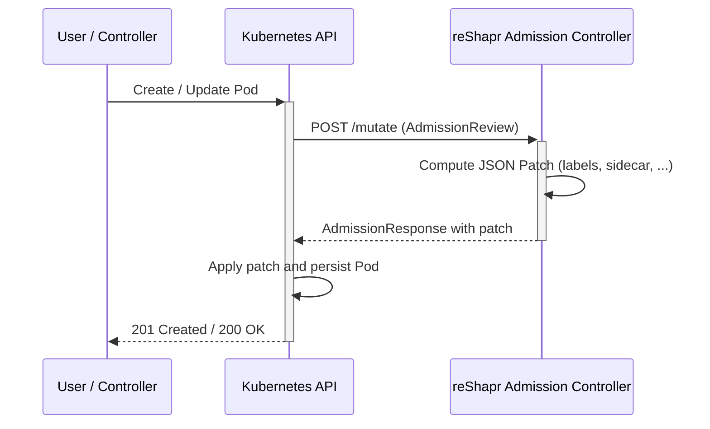

# Admission Controller

## Overview

The reShapr **Admission Controller** is a Kubernetes
[mutating admission webhook](https://kubernetes.io/docs/reference/access-authn-authz/extensible-admission-controllers/)
shipped as a standalone Quarkus application. It intercepts Pod `CREATE` and `UPDATE` operations
across the cluster and mutates the Pod specification to integrate applications with the reShapr
control plane — for example by injecting the reShapr proxy as a sidecar container.

The webhook is registered against the Kubernetes API through the
[`admission/k8s/mutating-webhook-configuration.yml`](../admission/k8s/mutating-webhook-configuration.yml)
manifest.

## Deployment topology

The admission controller is deployed in the `reshapr-system` namespace and consists of the
following Kubernetes objects (see [`admission/k8s/`](../admission/k8s/)):

| Object                                                | Purpose                                                                        |
|-------------------------------------------------------|--------------------------------------------------------------------------------|
| `ServiceAccount/reshapr-admission-controller`         | Identity used by the webhook Pod.                                              |
| `Deployment/reshapr-admission-controller`             | Runs the webhook container.                                                    |
| `Service/reshapr-admission-controller`                | Cluster-internal Service used by the Kubernetes API to reach the webhook (443).|
| `RoleBinding/reshapr-admission-controller`            | Grants the `view` cluster role to the webhook Service Account.                 |
| `Certificate` + `Issuer` (cert-manager)               | Provision the TLS material used to serve the webhook over HTTPS.               |
| `MutatingWebhookConfiguration/mutating.reshapr.io`    | Registers the webhook with the Kubernetes API server.                          |

### TLS with cert-manager

The webhook must be served over HTTPS with a certificate trusted by the Kubernetes API server.
[cert-manager](https://cert-manager.io/) is used to automate certificate issuance and rotation.

The `MutatingWebhookConfiguration` uses the well-known
`cert-manager.io/inject-ca-from` annotation so that cert-manager injects the CA bundle into the
webhook configuration when the certificate is issued:

```yaml
metadata:
  annotations:
    cert-manager.io/inject-ca-from: reshapr-system/reshapr-admission-controller
```

The generated `Secret` (`reshapr-admission-controller-tls-secret`) is mounted into the webhook
Pod at `/etc/certs`, and Quarkus is configured to serve HTTPS from it via the following
environment variables:

* `QUARKUS_HTTP_SSL_CERTIFICATE_KEY_STORE_FILE=/etc/certs/keystore.p12`
* `QUARKUS_HTTP_SSL_CERTIFICATE_KEY_STORE_FILE_TYPE=PKCS12`
* `QUARKUS_HTTP_SSL_CERTIFICATE_KEY_STORE_PASSWORD` — pulled from the
  `reshapr-admission-controller-tls-pass` Secret.

## Webhook configuration

The `MutatingWebhookConfiguration` intercepts every operation on Pod resources cluster-wide:

```yaml
webhooks:
  - name: mutating.reshapr.io
    rules:
      - apiGroups:   [""]
        apiVersions: ["v1"]
        operations:  ["*"]
        resources:   ["pods"]
        scope:       "Namespaced"
    clientConfig:
      service:
        namespace: reshapr-system
        name: reshapr-admission-controller
        path: "/mutate"
        port: 443
    admissionReviewVersions: ["v1"]
    sideEffects: None
    timeoutSeconds: 5
```

Key points:

* The webhook is bound to the `POST /mutate` endpoint served by the admission controller.
* `sideEffects: None` allows the API server to safely retry the webhook without side effects.
* `timeoutSeconds: 5` bounds how long the Kubernetes API server waits for the webhook response
  before failing the admission review.

## Mutation flow



The webhook is implemented on top of the
[Java Operator SDK webhooks framework](https://github.com/operator-framework/java-operator-sdk)
and its `Mutator<Pod>` API. Adding a new mutation is a matter of wiring an additional `Mutator`
implementation into `AdmissionControllers`.

## Operations

### Verify the webhook is running

```sh
kubectl -n reshapr-system get pods -l app.kubernetes.io/name=reshapr-admission-controller
kubectl get mutatingwebhookconfigurations mutating.reshapr.io
```

### Inspect webhook logs

```sh
kubectl -n reshapr-system logs -l app.kubernetes.io/name=reshapr-admission-controller -f
```

### Temporarily disable the webhook

If the webhook is misbehaving and blocks Pod creation cluster-wide, you can remove the
`MutatingWebhookConfiguration` without uninstalling the controller itself:

```sh
kubectl delete mutatingwebhookconfigurations mutating.reshapr.io
```

Reapply it once the issue is fixed:

```sh
kubectl apply -f admission/k8s/mutating-webhook-configuration.yml
```

> [!WARNING]
> The webhook currently matches **all Pods in all namespaces**. When customizing it, consider
> narrowing the scope with a `namespaceSelector` or `objectSelector` to avoid impacting
> unrelated workloads.
