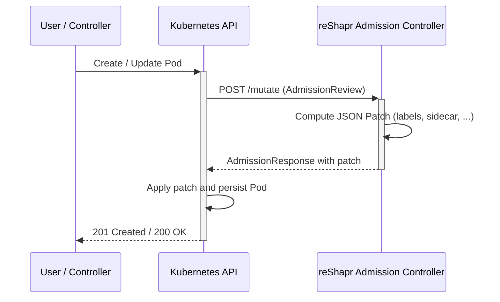

# Admission Controller

## Overview

The reShapr **Admission Controller** is a Kubernetes
[mutating admission webhook](https://kubernetes.io/docs/reference/access-authn-authz/extensible-admission-controllers/)
shipped as a standalone Quarkus application. It intercepts Pod `CREATE` operations and mutates
the Pod specification to integrate applications with the reShapr control plane — for example by
injecting the reShapr proxy as a sidecar container.

The webhook is registered against the Kubernetes API through the
[`admission/k8s/mutating-webhook-configuration.yml`](../admission/k8s/mutating-webhook-configuration.yml)
manifest.

## Deployment topology

The admission controller is deployed in the `reshapr-system` namespace and consists of the
following Kubernetes objects (see [`admission/k8s/`](../admission/k8s/)):

| Object                                                | Purpose                                                                        |
|-------------------------------------------------------|--------------------------------------------------------------------------------|
| `ServiceAccount/reshapr-admission-controller`         | Identity used by the webhook Pod.                                              |
| `Deployment/reshapr-admission-controller`             | Runs the webhook container.                                                    |
| `Service/reshapr-admission-controller`                | Cluster-internal Service used by the Kubernetes API to reach the webhook (443).|
| `RoleBinding/reshapr-admission-controller`            | Grants the `view` cluster role to the webhook Service Account.                 |
| `Certificate` + `Issuer` (cert-manager)               | Provision the TLS material used to serve the webhook over HTTPS.               |
| `MutatingWebhookConfiguration/mutating.reshapr.io`    | Registers the webhook with the Kubernetes API server.                          |

### TLS with cert-manager

The webhook must be served over HTTPS with a certificate trusted by the Kubernetes API server.
[cert-manager](https://cert-manager.io/) is used as the **default and recommended** way to
automate certificate issuance and rotation.

The `MutatingWebhookConfiguration` uses the well-known
`cert-manager.io/inject-ca-from` annotation so that cert-manager injects the CA bundle into the
webhook configuration when the certificate is issued:

```yaml
metadata:
  annotations:
    cert-manager.io/inject-ca-from: reshapr-system/reshapr-admission-controller
```

The generated `Secret` (`reshapr-admission-controller-tls-secret`) is mounted into the webhook
Pod at `/etc/certs`, and Quarkus is configured to serve HTTPS from it via the following
environment variables:

* `QUARKUS_HTTP_SSL_CERTIFICATE_KEY_STORE_FILE=/etc/certs/keystore.p12`
* `QUARKUS_HTTP_SSL_CERTIFICATE_KEY_STORE_FILE_TYPE=PKCS12`
* `QUARKUS_HTTP_SSL_CERTIFICATE_KEY_STORE_PASSWORD` — pulled from the
  `reshapr-admission-controller-tls-pass` Secret.

### Alternatives to cert-manager

Not every cluster runs cert-manager. The admission controller only requires **two things** to
be provided by the TLS bootstrap mechanism you choose, whatever it is:

1. A `Secret` in the `reshapr-system` namespace containing a **PKCS12 keystore** exposing a
   server certificate valid for the DNS name
   `reshapr-admission-controller.reshapr-system.svc`. The Deployment expects the following
   keys (see [`admission/k8s/admission-controller.yaml`](../admission/k8s/admission-controller.yaml)):
   * `keystore.p12` — the PKCS12 keystore itself (mounted at `/etc/certs/keystore.p12`),
   * a `password` key in the `reshapr-admission-controller-tls-pass` Secret — used to open the keystore.
2. The `caBundle` field of the `MutatingWebhookConfiguration` populated with the **CA
   certificate** that signed the server certificate above.

The sections below describe three alternative ways to satisfy these two requirements, ordered
from most portable to platform-specific.

#### Option A — Bring Your Own certificate (BYO)

If you already operate a corporate PKI (HashiCorp Vault PKI, AWS Private CA, Smallstep, an
internal ACME server, …), you can provision the certificate outside the cluster and inject it
as a plain Kubernetes `Secret`.

1. Issue a leaf certificate for the DNS name
   `reshapr-admission-controller.reshapr-system.svc` with your PKI.
2. Bundle the resulting certificate and private key into a PKCS12 keystore protected by a
   password. With `openssl`:

   ```sh
   openssl pkcs12 -export \
     -inkey tls.key -in tls.crt \
     -out keystore.p12 -password pass:$KEYSTORE_PASSWORD
   ```

3. Create the two Secrets in the `reshapr-system` namespace:

   ```sh
   kubectl -n reshapr-system create secret generic reshapr-admission-controller-tls-secret \
     --from-file=keystore.p12=./keystore.p12

   kubectl -n reshapr-system create secret generic reshapr-admission-controller-tls-pass \
     --from-literal=password=$KEYSTORE_PASSWORD
   ```

4. Remove the `cert-manager.io/inject-ca-from` annotation from the
   `MutatingWebhookConfiguration` and set `webhooks[0].clientConfig.caBundle` to the
   base64-encoded PEM of the CA that signed your certificate:

   ```yaml
   webhooks:
     - name: mutating.reshapr.io
       clientConfig:
         caBundle: <base64 PEM of the issuing CA>
         service:
           namespace: reshapr-system
           name: reshapr-admission-controller
           path: /mutate
           port: 443
   ```

**Trade-offs.** Zero cluster dependency and full control over the certificate policy, at the
cost of managing rotation yourself. Two useful companions:

* [External Secrets Operator](https://external-secrets.io/) to synchronise the `Secret` from
  Vault / AWS Secrets Manager / GCP Secret Manager / etc.,
* [Reloader](https://github.com/stakater/Reloader) to automatically restart the admission
  controller Pod when the underlying `Secret` is rotated.

#### Option B — Kubernetes CertificateSigningRequest API

Kubernetes ships a native [CSR API](https://kubernetes.io/docs/reference/access-authn-authz/certificate-signing-requests/)
that some clusters expose as a signer suitable for internal service certificates (typically
via the `kubernetes.io/kubelet-serving` signer or a cluster-specific one such as
`kubernetes.io/kube-apiserver-client-kubelet` on kubeadm-based clusters).

The high-level flow is:

1. Generate a private key and a Certificate Signing Request for
   `reshapr-admission-controller.reshapr-system.svc`.
2. Submit a `CertificateSigningRequest` object referencing the appropriate signer.
3. Approve it (`kubectl certificate approve <name>`), retrieve the signed certificate from
   `status.certificate`, and materialise the two Secrets described in Option A.
4. Use the signer's CA certificate as the `caBundle` in the `MutatingWebhookConfiguration`.

**Trade-offs.** No third-party dependency, cryptographic material never leaves the cluster,
but requires a signer that **accepts arbitrary DNS SANs and issues server certificates**
— not all managed distributions expose one. Also, this API does not renew certificates
automatically: you still need a Job or a `CronJob` to roll them before expiry.

> [!NOTE]
> Some clusters expose the API server's `extension-apiserver-authentication` CA (published in
> the `kube-system/extension-apiserver-authentication` `ConfigMap`) as an ambient trust
> anchor. Signing the webhook certificate with that CA is possible but very cluster-specific
> and not recommended for portable installations.

#### Option C — OpenShift `service-ca-operator`

On **OpenShift** (and OKD), the built-in
[Service CA Operator](https://docs.openshift.com/container-platform/latest/security/certificate_types_descriptions/service-ca-certificates.html)
covers both requirements out of the box with two annotations:

1. Annotate the `Service` so OpenShift generates a serving certificate as a `Secret`:

   ```yaml
   apiVersion: v1
   kind: Service
   metadata:
     name: reshapr-admission-controller
     namespace: reshapr-system
     annotations:
       service.beta.openshift.io/serving-cert-secret-name: reshapr-admission-controller-tls-secret
   ```

2. Annotate the `MutatingWebhookConfiguration` so the service CA operator injects the
   corresponding `caBundle` automatically:

   ```yaml
   apiVersion: admissionregistration.k8s.io/v1
   kind: MutatingWebhookConfiguration
   metadata:
     name: mutating.reshapr.io
     annotations:
       service.beta.openshift.io/inject-cabundle: "true"
   ```

Rotation is transparent — OpenShift updates the `Secret` and the `caBundle` in place before
expiry.

**Trade-offs.** Zero-config on OpenShift, but the resulting certificate is a PEM-formatted
`kubernetes.io/tls` Secret whereas the admission controller expects a PKCS12 keystore. You
will need to either:

* add a small `initContainer` that converts the mounted `tls.crt` + `tls.key` into
  `keystore.p12` at Pod startup with `openssl`, or
* replace the Quarkus keystore-based configuration by its PEM equivalent
  (`quarkus.http.ssl.certificate.files` / `quarkus.http.ssl.certificate.key-files`) via
  environment variables on the Deployment.

### Which option should I pick?

| Situation                                                              | Recommended option                       |
|------------------------------------------------------------------------|------------------------------------------|
| I already run cert-manager (or don't mind installing it)               | Default — cert-manager                    |
| I run OpenShift / OKD                                                  | Option C — `service-ca-operator`          |
| I have a corporate PKI and want to keep certificates in a central vault| Option A — BYO certificate                |
| My cluster exposes a usable signer and I want to stay Kubernetes-only  | Option B — CSR API                        |

## Webhook configuration

The `MutatingWebhookConfiguration` intercepts Pod creation across all workload namespaces:

```yaml
webhooks:
  - name: mutating.reshapr.io
    rules:
      - apiGroups:   [""]
        apiVersions: ["v1"]
        operations:  ["CREATE"]
        resources:   ["pods"]
        scope:       "Namespaced"
    # Never intercept pods in system namespaces — this prevents a self-deadlock where the
    # webhook cannot be (re)deployed because the API server calls it while it is down.
    namespaceSelector:
      matchExpressions:
        - key: kubernetes.io/metadata.name
          operator: NotIn
          values:
            - reshapr-system
            - kube-system
            - kube-node-lease
            - kube-public
    clientConfig:
      service:
        namespace: reshapr-system
        name: reshapr-admission-controller
        path: "/mutate"
        port: 443
    admissionReviewVersions: ["v1"]
    sideEffects: None
    # Fail open: if the webhook is unreachable, admit pods un-injected instead of blocking the cluster.
    failurePolicy: Ignore
    timeoutSeconds: 5
```

Key points:

* The webhook is bound to the `POST /mutate` endpoint served by the admission controller.
* Only Pod **`CREATE`** operations are intercepted — Pods are immutable after creation, so
  `UPDATE` would bring no value and only add overhead on the API server hot path.
* A `namespaceSelector` **excludes system namespaces** (`reshapr-system`, `kube-system`,
  `kube-node-lease`, `kube-public`). This is critical to prevent a **self-deadlock**: if the
  webhook were allowed to intercept its own namespace, the admission controller could not be
  (re)deployed while it is down, because the API server would call the unreachable webhook to
  admit its replacement Pod.
* `failurePolicy: Ignore` makes the webhook **fail open**: if the admission controller is
  unreachable or times out, Pods are admitted without sidecar injection instead of blocking the
  entire cluster. This trades a strong guarantee (every eligible Pod gets a sidecar) for a
  strong safety property (a failing webhook never freezes workload scheduling).
* `sideEffects: None` allows the API server to safely retry the webhook without side effects.
* `timeoutSeconds: 5` bounds how long the Kubernetes API server waits for the webhook response
  before falling back to `failurePolicy`.

## Mutation flow



> [!NOTE]
> The API-server-to-webhook call above is only made for Pod `CREATE` operations in
> non-system namespaces; other Pod operations and system namespaces are excluded by the
> `MutatingWebhookConfiguration` rules and `namespaceSelector`.

The webhook is implemented on top of the
[Java Operator SDK webhooks framework](https://github.com/operator-framework/java-operator-sdk)
and its `Mutator<Pod>` API. Adding a new mutation is a matter of wiring an additional `Mutator`
implementation into `AdmissionControllers`.

## Proxy sidecar injection

When a Pod carries the `io.reshapr/inject: "true"` annotation, the `PodMutator` injects a
`reshapr-proxy` sidecar container (HTTP `7777`, JGroups `7778`/`57778`) and labels the Pod with
`reshapr.io/proxy-injected: true`.

### Gateway identity

`RESHAPR_GATEWAY_ID` must be unique per Pod. Because `metadata.name` is not yet assigned during
admission for Pods created with `generateName`, the webhook injects `POD_NAME` via the Downward API
and sets `RESHAPR_GATEWAY_ID` to `$(POD_NAME)` (or `<prefix>-$(POD_NAME)` when the
`io.reshapr/gateway-id-prefix` annotation is set), which Kubernetes expands at runtime.

### Configuration resolution

Values that cannot be computed from the Pod are resolved with the following precedence:

1. an explicit **annotation** on the Pod (propagated from the Deployment pod template);
2. a **namespace-local Secret** — `reshapr-proxy-config` by default, overridable with the
   `io.reshapr/config-secret-name` annotation. This Secret must be pre-deployed in the Pod's
   namespace.

Sensitive values (`RESHAPR_CTRL_TOKEN`, `RESHAPR_CLUSTER_STORE_PASSWORD`,
`RESHAPR_CLUSTER_KEY_PASSWORD`) are **always** sourced from the Secret through `secretKeyRef`
references, so they never appear in clear text in the Pod spec.

| Env var                          | Annotation                              | Secret key                  | Source when annotation absent |
|----------------------------------|-----------------------------------------|-----------------------------|-------------------------------|
| `RESHAPR_GATEWAY_ID`             | `io.reshapr/gateway-id-prefix`          | —                           | `$(POD_NAME)`                 |
| `RESHAPR_GATEWAY_FQDNS`          | `io.reshapr/gateway-fqdns`              | `gateway-fqdns`             | optional `secretKeyRef`       |
| `RESHAPR_GATEWAY_LABELS`         | `io.reshapr/gateway-labels`             | `gateway-labels`            | optional `secretKeyRef`       |
| `RESHAPR_CTRL_HOST`              | `io.reshapr/control-plane-host`         | `control-plane-host`        | optional `secretKeyRef`       |
| `RESHAPR_CTRL_PORT`              | `io.reshapr/control-plane-port`         | `control-plane-port`        | optional `secretKeyRef`       |
| `RESHAPR_CTRL_TLS_PLAINTEXT`     | `io.reshapr/control-plane-tls-plaintext`| `control-plane-tls-plaintext` | optional `secretKeyRef`     |
| `RESHAPR_CTRL_TOKEN`             | —                                       | `control-plane-token`       | required `secretKeyRef`       |
| `RESHAPR_CLUSTER_STORE_PASSWORD` | —                                       | `cluster-store-password`    | required `secretKeyRef`       |
| `RESHAPR_CLUSTER_KEY_PASSWORD`   | —                                       | `cluster-key-password`      | required `secretKeyRef`       |

The sidecar image can be overridden with the `io.reshapr/proxy-image` annotation.

Example configuration Secret:

```sh
kubectl -n <namespace> create secret generic reshapr-proxy-config \
  --from-literal=control-plane-host=reshapr-control-plane-ctrl.reshapr-system \
  --from-literal=control-plane-port=5555 \
  --from-literal=control-plane-token=<gateway-token> \
  --from-literal=gateway-labels='env=prod;team=reshapr' \
  --from-literal=cluster-store-password=<store-password> \
  --from-literal=cluster-key-password=<key-password> \
  --from-file=reshapr-cluster.jceks=./reshapr-cluster.jceks
```

### Services provisioned by the `DeploymentProxyReconciler`

The mutating webhook is declared `sideEffects: None`, so it cannot create Services itself. The
`DeploymentProxyReconciler` — bundled in the admission controller — watches Deployments whose **pod
template** carries the `io.reshapr/inject: "true"` annotation (the same single source of truth the
webhook reads on the resulting Pods) and provisions two Services, both owned by the Deployment
(garbage-collected with it) and selecting Pods labelled `reshapr.io/proxy-injected: true`:

| Service                          | Type      | Ports         | Purpose                                                        |
|----------------------------------|-----------|---------------|----------------------------------------------------------------|
| `reshapr-proxy-<deployment>`     | headless  | `7778`,`57778`| JGroups DNS_PING cluster discovery (Infinispan SYM_ENCRYPT)    |
| `reshapr-proxy-<deployment>-mcp` | ClusterIP | `7777`        | Load-balanced MCP endpoint — point your Ingress/Gateway here   |

The MCP Service is **opt-in enabled by default**; disable it with `io.reshapr/expose-mcp: "false"`
on the pod template (e.g. when the MCP endpoint is fronted by an external mesh/gateway). Two separate
Services are used on purpose: the discovery Service must be headless so every Pod IP is individually
resolvable for DNS_PING, whereas MCP client traffic wants a load-balanced ClusterIP. The
`reshapr-cluster.jceks` keystore is mounted from the configuration Secret at `/etc/reshapr/keystore`.

Because this reconciler watches Deployments and manages Services cluster-wide, the admission
controller's ServiceAccount is bound to a dedicated `ClusterRole` (see
[`admission/k8s/admission-controller.yaml`](../admission/k8s/admission-controller.yaml)) granting
`get`/`list`/`watch` on `deployments` and `get`/`list`/`watch`/`create`/`delete` on `services`.

## Operations


### Verify the webhook is running

```sh
kubectl -n reshapr-system get pods -l app.kubernetes.io/name=reshapr-admission-controller
kubectl get mutatingwebhookconfigurations mutating.reshapr.io
```

### Inspect webhook logs

```sh
kubectl -n reshapr-system logs -l app.kubernetes.io/name=reshapr-admission-controller -f
```

### Temporarily disable the webhook

If the webhook is misbehaving and blocks Pod creation cluster-wide, you can remove the
`MutatingWebhookConfiguration` without uninstalling the controller itself:

```sh
kubectl delete mutatingwebhookconfigurations mutating.reshapr.io
```

Reapply it once the issue is fixed:

```sh
kubectl apply -f admission/k8s/mutating-webhook-configuration.yml
```

> [!NOTE]
> The webhook already excludes the `reshapr-system`, `kube-system`, `kube-node-lease` and
> `kube-public` namespaces via a `namespaceSelector`, and is configured with
> `failurePolicy: Ignore` so that an unreachable webhook does not block Pod creation
> cluster-wide. If you narrow the scope further (for example with an `objectSelector` or an
> additional `namespaceSelector`), make sure your changes still preserve these safety
> properties.
