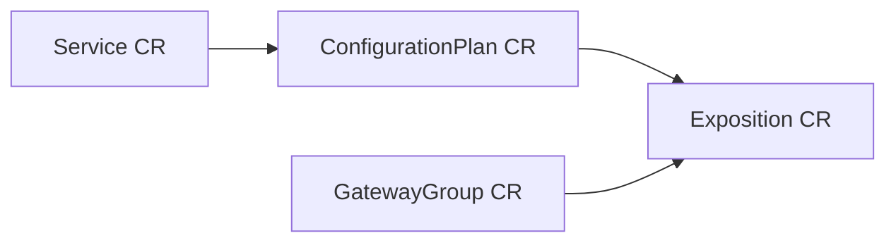

# Exposition Custom Resource

## Overview

The `Exposition` Custom Resource (CR) allows you to **expose a reShapr [Service](./service-cr.md)
on a [GatewayGroup](./gatewaygroup-cr.md) through a specific
[ConfigurationPlan](./configurationplan-cr.md)**. In other words, an `Exposition` is the final
binding that instructs reShapr gateways matching the target GatewayGroup to serve a given
Service according to a given Configuration Plan.

The `Exposition` CRD is defined using the `reshapr.io/v1alpha1` API version. The full schema
definition is available in
[`expositions.reshapr.io-v1.yml`](../deploy/crd/expositions.reshapr.io-v1.yml).

At a higher level, an `Exposition` resource is organized using the following structure:

```yaml
apiVersion: reshapr.io/v1alpha1
kind: Exposition
metadata:
  name: open-meteo-gitops-exposition
  annotations:
    reshapr.io/instance: reshapr-control-plane-ctrl.reshapr-system
    reshapr.io/organization: reshapr
spec:
  service:
    name: open-meteo-api
    version: '1.0'
  configurationPlan: open-meteo-gitops-configurationplan
  gatewayGroup: 'Default Gateway Group'
  keepOnDelete: false
```

`spec.service`, `spec.configurationPlan` and `spec.gatewayGroup` are all mandatory: an
Exposition requires the three coordinates (which Service, which plan, which gateway group) to
be reconcilable.

> [!NOTE]
> The `spec.service` reference is used to **scope the ConfigurationPlan lookup** — Configuration
> Plan names are not globally unique, they are unique per Service. Providing the target Service
> ensures the operator resolves the correct plan.

The instance-targeting annotations (`reshapr.io/instance`, `reshapr.io/organization`) are
mandatory — see the [Instance connection flow](./instance-connection.md) for details.

Once created in your namespace, you can list existing expositions with:

```sh
$ kubectl get expositions.reshapr.io -n my-ns
NAME                            AGE
open-meteo-gitops-exposition     1d
```

You can also use the short name `exposition`.

## Status structure

```yaml
apiVersion: reshapr.io/v1alpha1
kind: Exposition
metadata:
  name: open-meteo-gitops-exposition
spec:
  [...]
status:
  status: READY
  observedGeneration: 1
  expositionId: 66ca3b482a11675200f87792
  message: Exposition of 'open-meteo-api:1.0' on 'Default Gateway Group' is ready
```

| Field                        | Description                                                                                     |
|------------------------------|-------------------------------------------------------------------------------------------------|
| `status.status`              | Global reconciliation status: `UNKNOWN`, `IN_PROGRESS`, `PREEXISTING`, `READY`, or `ERROR`.     |
| `status.message`             | Human-readable message giving details about the current status.                                 |
| `status.observedGeneration`  | The `metadata.generation` value at the time of the last successful reconciliation.              |
| `status.expositionId`        | Unique identifier of the corresponding Exposition in the reShapr control plane.                 |

## Exposition specification details

| Property             | Description                                                                                                                                                              |
|----------------------|--------------------------------------------------------------------------------------------------------------------------------------------------------------------------|
| `service`            | **Mandatory**. Reference to the target [Service](./service-cr.md) being exposed. See _Service reference_ below. Also used to scope the ConfigurationPlan lookup.          |
| `configurationPlan`  | **Mandatory**. Name of the target [ConfigurationPlan](./configurationplan-cr.md) attached to the Service.                                                                |
| `gatewayGroup`       | **Mandatory**. Name of the target [GatewayGroup](./gatewaygroup-cr.md) on which the Service must be exposed.                                                             |
| `keepOnDelete`       | **Optional**. When `true`, deleting the CR keeps the Exposition in the control plane. Defaults to `false`.                                                               |

### Service reference (`spec.service`)

| Property   | Description                                                                                                                             |
|------------|-----------------------------------------------------------------------------------------------------------------------------------------|
| `name`     | **Mandatory**. Human-readable name of the target Service.                                                                                |
| `version`  | **Optional**. Human-readable version of the target Service. Recommended when several versions of the same Service coexist.               |

## Relationship with other custom resources

An `Exposition` sits at the top of the reShapr configuration graph and requires all its
dependencies to be present and `READY` in the target control plane:



Typical apply order in a GitOps repository:

1. `Service` — to import the API artifact,
2. `GatewayGroup` — to declare where the Service can be exposed,
3. `ConfigurationPlan` — to bind the Service to a backend endpoint,
4. `Exposition` — to actually publish that plan on the group of gateways.

> [!WARNING]
> If the target `ConfigurationPlan` or `GatewayGroup` cannot be found in the control plane, the
> reconciliation ends in the `ERROR` state and is retried later. Make sure the corresponding CRs
> have already reached the `READY` state.

## Complete example

```yaml
apiVersion: reshapr.io/v1alpha1
kind: Exposition
metadata:
  name: pastries-prod-exposition
  namespace: default
  annotations:
    reshapr.io/instance: reshapr-control-plane-ctrl.reshapr-system
    reshapr.io/organization: reshapr
spec:
  service:
    name: API Pastries
    version: 0.0.1
  configurationPlan: pastries-prod-plan
  gatewayGroup: prod-gateway-group
  keepOnDelete: true
```
