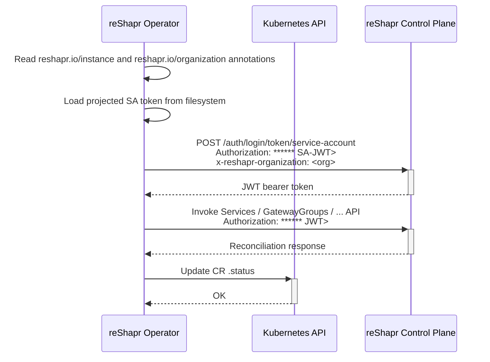

# Instance connection flow

All reShapr Custom Resources managed by the operator target a specific reShapr **control plane
instance** running in the cluster. This page describes how a CR points to that instance and how
the operator securely authenticates with it during reconciliation.

## Targeting an instance

Every CR reconciled by the operator must carry two annotations:

| Annotation                | Description                                                                                                                                                                        |
|---------------------------|------------------------------------------------------------------------------------------------------------------------------------------------------------------------------------|
| `reshapr.io/instance`     | **Mandatory**. The qualified name of the control plane Kubernetes Service. Typical form is `<service-name>.<namespace>`, e.g. `reshapr-control-plane-ctrl.reshapr-system`.          |
| `reshapr.io/organization` | **Mandatory**. The reShapr organization the resource belongs to. This is used to impersonate the correct tenant when calling the control plane API.                                |

Example on a `Service` custom resource:

```yaml
apiVersion: reshapr.io/v1alpha1
kind: Service
metadata:
  name: open-meteo-api
  annotations:
    reshapr.io/instance: reshapr-control-plane-ctrl.reshapr-system
    reshapr.io/organization: reshapr
spec:
  url: https://raw.githubusercontent.com/open-meteo/open-meteo/refs/heads/main/openapi/forecast.yml
```

> [!WARNING]
> If either annotation is missing, the reconciliation stops early and the CR is marked with the
> `ERROR` status. Add the annotations and the operator will retry automatically.

## Authentication flow

The operator authenticates with the control plane using a **projected Kubernetes service account
token** exchanged for a JWT bearer token. The following sequence is executed on every
reconciliation:



Detailed steps:

1. The operator extracts the `reshapr.io/instance` and `reshapr.io/organization` annotations
   from the reconciled CR.
2. It reads the projected service account token mounted inside the operator Pod (standard
   Kubernetes projected token pattern).
3. It calls `POST /auth/login/token/service-account` on the control plane instance, providing:
   * `Authorization: Bearer <projected-SA-token>` header,
   * `x-reshapr-organization: <organization>` header.
4. The control plane validates the token via the Kubernetes TokenReview API, resolves the
   organization, and returns a short-lived JWT bearer token.
5. All subsequent reShapr API calls use this JWT until it expires; if authentication fails, the
   reconciliation is retried after 30 seconds.

## Failure modes

The `.status.status` field of the CR reflects the outcome of the connection flow:

| Status        | Description                                                                                                       |
|---------------|-------------------------------------------------------------------------------------------------------------------|
| `UNKNOWN`     | Default value before any reconciliation attempt.                                                                  |
| `IN_PROGRESS` | The reconciliation is in progress; the operator is calling the control plane.                                     |
| `PREEXISTING` | The target object already exists in the control plane and was adopted.                                            |
| `READY`       | Reconciliation succeeded; the CR is in sync with the control plane.                                               |
| `ERROR`       | A recoverable or non-recoverable failure occurred. See `.status.message` for details.                             |

Common error messages you may find in `.status.message`:

* `Missing required annotation 'reshapr.io/instance'` — add the annotation to your CR.
* `Missing required annotation 'reshapr.io/organization'` — add the annotation to your CR.
* `Failed to authenticate with reShapr control plane` — the service account is not authorized on
  the target organization or the control plane is unreachable; the operator retries every 30s.
